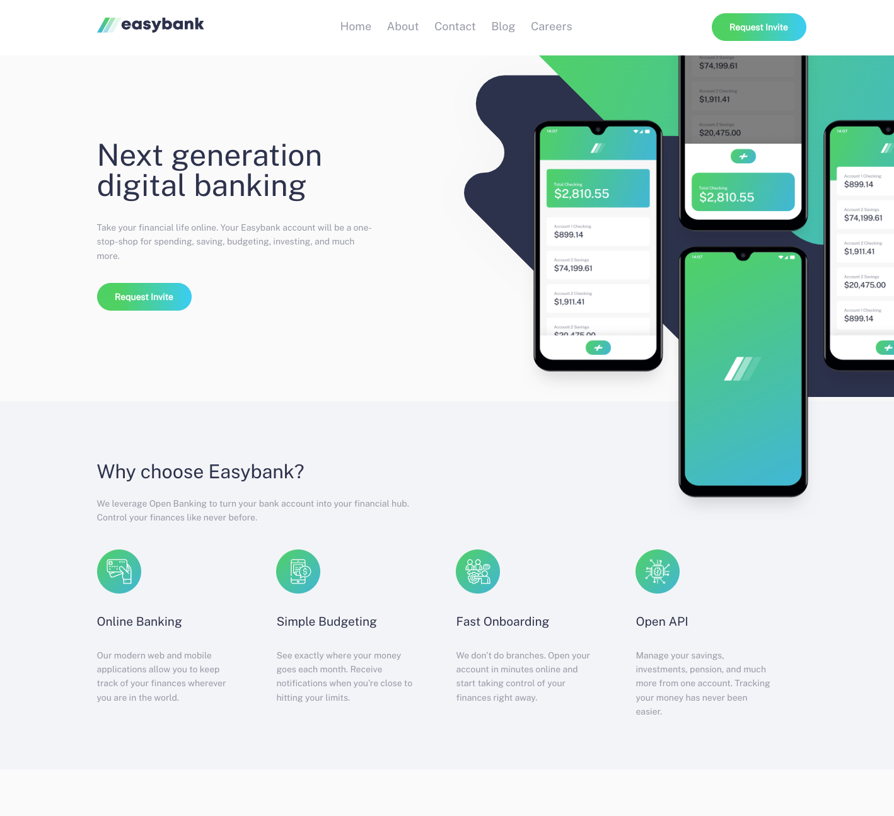

# Frontend Mentor - Easybank landing page solution

This is a solution to the [Easybank landing page challenge on Frontend Mentor](https://www.frontendmentor.io/challenges/easybank-landing-page-WaUhkoDN). Frontend Mentor challenges help you improve your coding skills by building realistic projects. 

## Table of contents

- [Overview](#overview)
  - [The challenge](#the-challenge)
  - [Screenshot](#screenshot)
  - [Links](#links)
- [My process](#my-process)
  - [Built with](#built-with)
  - [What I learned](#what-i-learned)
  - [Continued development](#continued-development)
  - [Useful resources](#useful-resources)
- [Author](#author)

## Overview

### The challenge

Users should be able to:

- View the optimal layout for the site depending on their device's screen size
- See hover states for all interactive elements on the page

### Screenshot



### Links

- Solution URL: (https://www.frontendmentor.io/solutions/mobilefirst-solution-using-bootstrap-grid-PYNR5awNAY)
- Live Site URL: (https://ramikoff.github.io/easybank-landing-page-master/)

## My process

### Built with

- Semantic HTML5 markup
- BEM methodology
- Flexbox
- Bootstrap Grid
- Mobile-first workflow


### What I learned

- How to use bootstrap grid system only
- How to position a background-image

Some HTML code I'm proud of
```html
  <!--HERO-->
<section id='hero' class='hero container-fluid bg-primary'>
  <div class='container'>
    <div class='row'>
      <div class='hero__content-box col-12 col-md-6 col-lg-5 order-1 order-md-0'>
        <h1 class='h1 hero__heading'>
          Next generation digital banking
        </h1>
        <p class='hero__content'>
          Take your financial life online. Your Easybank account will be a one-stop-shop
          for spending, saving, budgeting, investing, and much more.
        </p>
        <a class='button d-block'>Request Invite</a>
      </div>
      
    </div>
  </div>
</section>
```

Some SCSS code I'm proud of
```scss
.hero {
  padding-bottom: 3rem;
  background-image: url(/src/assets/img/image-mockups.png), url(/src/assets/img/bg-intro-mobile.svg);
  background-position: center top -50px, center top;
  background-repeat: no-repeat, no-repeat;
  background-size: 90%, contain;
  &__content-box {
   text-align: center;
   margin-top: calc(20vh + 280px);
 }
}

.button {
  display: block;
  background: linear-gradient(90deg, rgba(49, 211, 92, 1) 0%, rgba(49, 211, 92, 1) 24%, rgba(6, 205, 247, 1) 100%);
  text-align: center;
  padding: 15px;
  border-radius: 120px;
  max-width: 150px;
  color: white;
  font-size: 14px;
  font-weight: bold;

  &:hover, &:focus {
    background: linear-gradient(90deg, rgba(49, 211, 80, 0.4248074229691877) 0%, rgba(49, 211, 92, 0.5060399159663865) 24%, rgba(6, 205, 247, 0.5648634453781513) 100%);
  }
}
```

### Continued development

In future projects I want to focus on react and typescript

### Useful resources

- [https://developer.mozilla.org/](https://developer.mozilla.org) 
- [https://www.youtube.com/](https://www.youtube.com) 
- [https://css-tricks.com/positioning-offset-background-images/](https://css-tricks.com/positioning-offset-background-images/)


## Author

- linkedin - [Ramil Novruzov](https://www.linkedin.com/in/ramilnovruzov/)
- Frontend Mentor - [@ramikoff](https://www.frontendmentor.io/profile/ramikoff)


